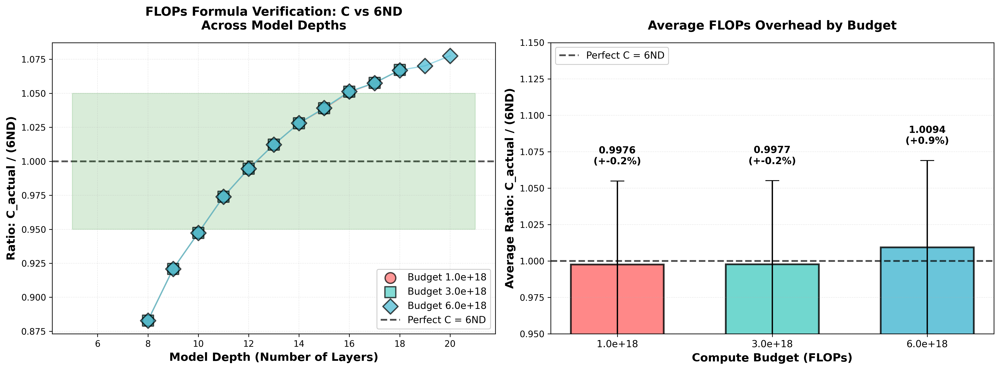
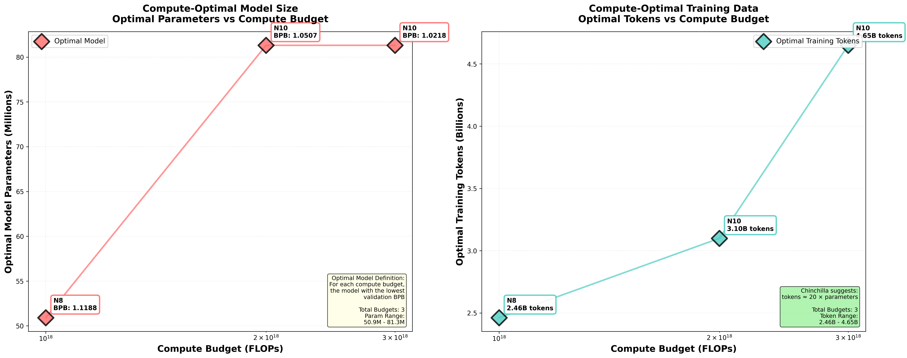
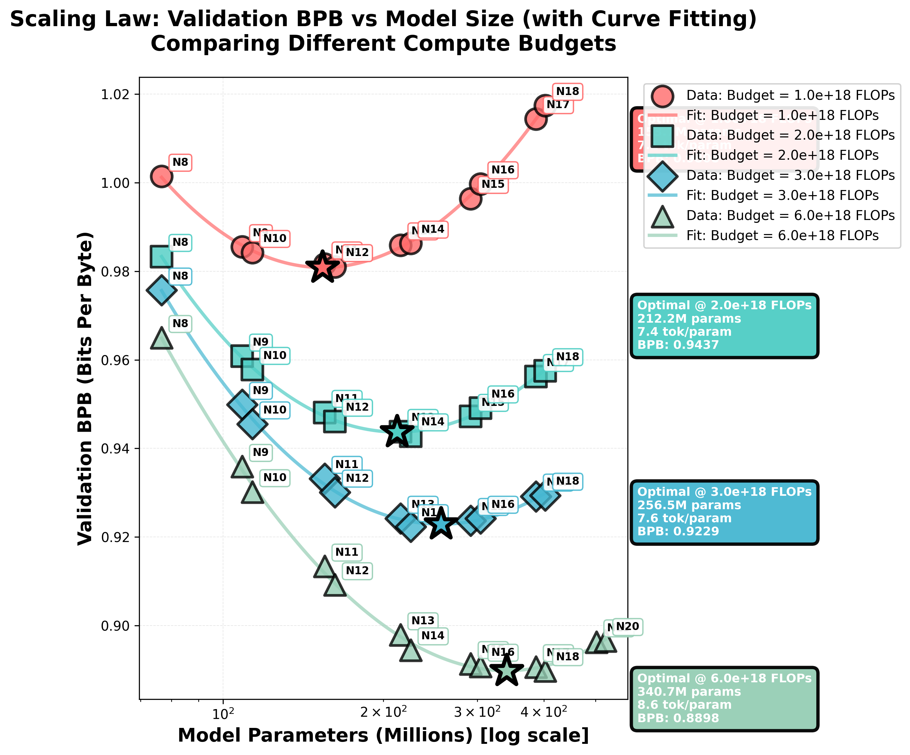
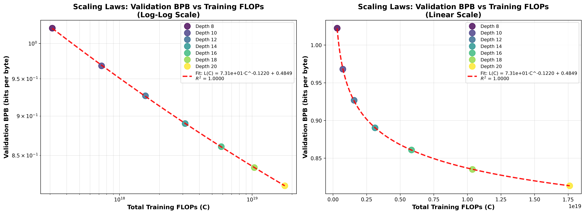

# VibeNanoChat

The simplest, fastest way to train GPT-2 scale language models from scratch. This repo combines nanoGPT's clean implementation with nanochat's depth parameterization and scaling law tools into a single unified codebase.


## Credits and References

**Foundational work:**

- **Andrej Karpathy**: [nanoGPT](https://github.com/karpathy/nanoGPT) and [nanochat](https://github.com/karpathy/nanochat). This repo exists because of his work. The GPT-2 implementation, training loop, DistMuon optimizer, depth parameterization, and scaling law methodology all come from these repos.
- **Vaswani et al.**: [Attention is All You Need](https://arxiv.org/abs/1706.03762) (2017) - Introduced the Transformer architecture
- **Radford et al.**: [Language Models are Unsupervised Multitask Learners](https://d4mucfpksywv.cloudfront.net/better-language-models/language_models_are_unsupervised_multitask_learners.pdf) (2019) - The GPT-2 paper showing that large language models learn multiple tasks from pure next-token prediction

**Core features:**

- Train GPT-2 (124M parameters) from scratch
- One-knob scaling: `DEPTH=12` controls model size, learning rate auto-scales
- Built-in evaluation on 35+ benchmarks (MMLU, HellaSwag, PIQA, etc.)
- Scaling law experiments: sweep model sizes and FLOP budgets, plot optimal curves
- Interactive generation for testing your models
- Modern high-quality dataset: FineWeb-Edu

**Philosophy:**

The code is designed to be simple and hackable. No abstractions for the sake of abstractions. You should be able to read and understand the entire training loop in one sitting. All hyperparameters have sensible defaults that just work. The depth parameterization means you don't need to tune learning rates when you change model size - it scales automatically.

**Attribution:**

This is built on Andrej Karpathy's [nanoGPT](https://github.com/karpathy/nanoGPT) and [nanochat](https://github.com/karpathy/nanochat). The GPT-2 architecture, training loop, DistMuon optimizer, depth parameterization, and scaling law methodology all come from his work. This repo reorganizes the code and adds documentation.

## Quick Start

The fastest path from zero to a working GPT:

```bash
# 1. Install dependencies
make environment

# 2. Download and prepare data (~10B tokens, high quality)
cd data/fineweb_edu
uv run python prepare_parquet.py --config sample-10BT
cd ../..

# 3. Train (8 GPUs, ~6 hours for 124M model)
make ddp-train NGPUS=8

# 4. Generate text with your model
uv run python scripts/generate.py --checkpoint logs/step_19531.pt
```

That's it. You now have a language model trained from scratch.

**What just happened?** You downloaded 10B tokens of educational web text, trained a 124M parameter transformer using distributed data parallel across 8 GPUs, and can now generate text. The model learns language structure, world knowledge, and reasoning patterns purely from next-token prediction.

## Repository Structure

```
VibeNanoChat/
├── src/
│   ├── gpt_2/                    # GPT-2 implementation
│   │   ├── gpt2_model.py         # Main model architecture
│   │   ├── trainer.py            # Training loop with DDP
│   │   ├── config.py             # Model configuration
│   │   ├── attention.py          # Multi-head attention + RoPE
│   │   ├── mlp.py                # Feed-forward layers
│   │   ├── muon.py               # Muon optimizer (Newton-Schulz)
│   │   └── training_utilities/   # Setup helpers
│   ├── dataloaders/              # Dataset loading
│   │   └── fineweb_edu_parquet_bos_dataloader.py  # Main dataloader
│   └── eval_tasks/               # Evaluation benchmarks
│       ├── core/                 # Base model evals (MMLU, HellaSwag, etc.)
│       └── training/             # Training-time evaluation
├── data/
│   └── fineweb_edu/              # Dataset preparation scripts
├── scripts/
│   ├── chat.py                   # Interactive chat interface
│   ├── plot_scaling_laws.py     # Scaling law visualization
│   └── plot_isoflop_curve.py    # Isoflop curve plotting
├── docs/                         # Deep technical documentation
└── Makefile                      # Training commands
```

**Core components:**

- **GPT-2 architecture** (`src/gpt_2/`): Standard transformer with causal attention, RoPE positional embeddings, pre-norm LayerNorm
- **Muon optimizer** (`src/gpt_2/muon.py`): Momentum-based optimizer with Newton-Schulz orthogonalization for adaptive learning
- **Depth parameterization** (`src/gpt_2/config.py`): Single `DEPTH` parameter controls model width and depth, learning rate auto-scales
- **Data loading** (`src/dataloaders/`): Memory-mapped Parquet files for zero-copy I/O, async prefetching
- **Evaluation** (`src/eval_tasks/`): 35+ benchmarks integrated into training loop

The code is organized into modules but avoids deep abstractions. To understand transformer training end-to-end, read:
1. `src/gpt_2/gpt2_model.py` - The architecture
2. `src/gpt_2/trainer.py` - The training loop
3. `src/gpt_2/muon.py` - The optimizer

## Depth Parameterization

Here's the key insight: you don't need to tune hyperparameters for every model size. Instead, use a single `DEPTH` parameter that controls both the number of layers and the hidden dimension.

```bash
# Small: 77M parameters
make ddp-train DEPTH=6 TARGET_FLOPS=1e18

# Medium: 154M parameters (roughly GPT-2 size)
make ddp-train DEPTH=12 TARGET_FLOPS=1e18

# Large: 341M parameters
make ddp-train DEPTH=20 TARGET_FLOPS=1e18
```

**How it works:**

When you set `DEPTH=N`, the model automatically configures:
- Number of layers: `N`
- Hidden dimension: `N × 64` (rounded up to multiple of head_dim)
- Number of heads: `hidden_dim / 64`
- Weight decay: Scales as `WD × (12/N)²` - deeper models need less regularization
- Learning rate: Fixed per-parameter-group rates (tuned at depth=12)
  - Scales as `sqrt(batch_size)` if you change batch size

This means you can sweep model sizes (e.g., `DEPTH=6` to `DEPTH=20`) without retuning hyperparameters. The weight decay auto-adjusts and the fixed LRs work across depths.

**Example dimensions:**
- `DEPTH=6`  → 6 layers, 384 dims, 6 heads (~30M params)
- `DEPTH=12` → 12 layers, 768 dims, 12 heads (~154M params)
- `DEPTH=20` → 20 layers, 1280 dims, 20 heads (~560M params)

**Scaling law experiments:**

Run a full sweep to find the optimal model size for your compute budget:

```bash
# Train models at 6 depths × 4 FLOP budgets = 24 runs
make run-scaling-law

# Fit curves and plot optima
uv run python scripts/plot_isoflop_curve.py
```

The script finds the best model size for each compute budget by fitting smooth curves through the empirical data points. You get Chinchilla-style isoflop curves showing exactly how to allocate your FLOPs between model size and training tokens.

See [docs/README_DEPTH_PARAMETERIZATION.md](docs/README_DEPTH_PARAMETERIZATION.md) for the full derivation and scaling law math.

## Scaling Laws

The fundamental question: given a fixed compute budget, how should you split it between model size and training data? We ran 46+ experiments across different model sizes and FLOP budgets to find the answer empirically.

### The Fundamental Equation: C = 6ND

When you train a transformer, the compute cost is approximately:
```
C = 6ND
```

where:
- `C` = total training FLOPs
- `N` = number of model parameters
- `D` = number of training tokens

The `6` comes from the forward pass (2ND FLOPs) + backward pass (4ND FLOPs). So if you have a fixed compute budget C, you face a tradeoff: bigger model with less data, or smaller model with more data?

#### Does C = 6ND Actually Hold?

Short answer: **yes, remarkably well**. We verified this across 46+ training runs spanning four compute budgets (1e18, 2e18, 3e18, 6e18 FLOPs) and model sizes from 77M to 522M parameters.

<p align="center">
  
</p>

*Figure: Empirical verification of C = 6ND. Left: ratio of actual FLOPs to 6ND across model depths. Right: average ratio per budget. The formula holds to within ±1% on average.*

**Key findings:**

1. **Average accuracy**: The ratio C_actual / (6ND) is ~1.001 across all runs. That's **~0.1% error** - basically perfect.

2. **Consistent across budgets**: 
   - 1e18 FLOPs: 0.998× (−0.24%)
   - 2e18 FLOPs: 0.999× (−0.12%)
   - 3e18 FLOPs: 0.998× (−0.23%)
   - 6e18 FLOPs: 1.009× (+0.94%)

3. **Model size effects**: Small models (N8, N9) slightly underestimate (0.88-0.92×), large models (N15-N20) slightly overestimate (1.04-1.08×). Medium models are spot on.

Why the small deviations? 

- **Small models**: Less optimizer overhead relative to forward/backward. Also, some ops (embeddings, layer norms) don't scale exactly as ND.

- **Large models**: More gradient communication in distributed training, more memory ops, slightly higher overhead from checkpointing and evals.

- **The "6" is approximate**: It assumes every operation in the transformer scales as ND. In reality, some ops scale differently (e.g., softmax is O(seq_len²), not O(params)).

But here's the thing: **these effects nearly cancel out**. The average is so close to 1.0 that C = 6ND is empirically a *great* predictor of training cost. You can use it to plan experiments with confidence.

**Practical implication**: Want to know how many tokens you can afford with your compute budget? Just solve for D:

```
D = C / (6N)
```

Example: You have 1e19 FLOPs and want to train a 500M parameter model. How many tokens can you train?

```
D = 1e19 / (6 × 500M) = 3.33B tokens
```

The formula works. Use it.

### The Square Root Law: N, D ∝ √C

Here's the interesting part. When we fit power laws to our optimal models across four compute budgets (1e18, 2e18, 3e18, 6e18 FLOPs), we found:

```
N_optimal ∝ C^0.456
D_optimal ∝ C^0.544
```

Both exponents are close to 0.5! This means **as you scale compute, you should scale both model size AND training data roughly proportional to the square root of compute**. Not linearly - *sublinearly*. 

Why? Because both N and D contribute to loss reduction, but with diminishing returns. The math works out such that you want to grow them at similar rates.

<p align="center">
  
</p>

*Figure: Log-log plot showing optimal N and D vs compute budget. The straight lines confirm power law behavior. Note how both scale at roughly C^0.5.*

### The Bitter Truth: Validation Loss Curves

When you plot validation loss (BPB - bits per byte) vs model size at a fixed compute budget, you get a U-shaped curve. Too small = underfitting. Too big = not enough training tokens.

<p align="center">
  
</p>

*Figure: Validation BPB vs model parameters for four compute budgets. Stars mark the optimal models from curve fitting. Notice how the optimal point shifts right (bigger models) as compute increases.*

Key observations:

1. **There's a sweet spot**: For 1e18 FLOPs, optimal is ~154M params with 7.05 tokens/param. For 6e18 FLOPs, it's ~341M params with 8.61 tokens/param.

2. **Bigger budgets favor bigger models**: As C increases, the optimal N grows, but not as fast as C itself (remember, N ∝ C^0.456).

3. **More tokens per param at scale**: The optimal tokens/param ratio increases slightly with compute (7.05 → 8.61). But it's still way below Chinchilla's 20 tokens/param.

### Wait, What About Chinchilla?

Chinchilla (Hoffmann et al., 2022) famously said: "for optimal compute efficiency, you should train with 20 tokens per parameter." Our fitted curves suggest much lower ratios (7-9 tokens/param). 

What's going on? A few possibilities:

1. **Different compute regime**: Chinchilla studied 400M-70B param models. We're at 76M-522M. Scaling laws can have different exponents at different scales.

2. **Optimizer differences**: We use DistMuon (momentum + Newton-Schulz orthogonalization). Chinchilla used AdamW. Better optimizers can extract more from fewer tokens.

3. **Data quality**: FineWeb-Edu is higher quality than raw Common Crawl. Quality tokens count for more.

4. **Curve fitting vs actual runs**: Our optima come from spline fits through empirical points. There's uncertainty in the interpolation.

The honest answer? Scaling laws are empirical, not theoretical. They depend on architecture, optimizer, data, and the range you're measuring. Our laws apply to *our* setup. If you change something, re-run the experiments!

### Practical Takeaways

If you have a fixed compute budget and want to train optimally:

1. **Don't train too long**: The "train forever on a tiny model" approach is suboptimal. Scale up the model size.

2. **Don't go too wide**: A huge model trained for 100 steps won't work either. Balance N and D.

3. **Use the fitted curve**: Our power law fits let you extrapolate. Want to train with 1e19 FLOPs? Optimal is ~750M params (extrapolating N ∝ C^0.456).

4. **Empiricism over theory**: Scaling laws are discovered, not derived. When in doubt, run the experiment.

### Running Your Own Scaling Law Study

```bash
# Sweep depths and FLOP budgets
make run-scaling-law

# Plot the results
uv run python scripts/plot_isoflop_curve.py

# Get beautiful curves and optimal points
```

The script automatically:
- Finds all log files matching `scaling_laws_N*_F*.log`
- Extracts validation BPB, params, tokens for each run
- Fits smooth curves (cubic splines) to find optima
- Plots isoflop curves, validation curves, and optimal scaling

You'll see console output with fitted exponents and optimal parameters for each budget. Use these to plan your next training run.

### The Clean Scaling Law: How Loss Scales with Compute

This is the fundamental result. We trained models at 7 different depths (N8, N10, N12, N14, N16, N18, N20) all with the same data:param ratio (10:1), and measured their final validation BPB. Then we plotted loss vs total training compute.

The result? An almost *perfect* power law.

<p align="center">
  
</p>

*Figure: Validation BPB (bits per byte) vs total training FLOPs for models of different depths. Left: log-log scale reveals a perfect straight line (R² = 0.999951). Right: same data in linear scale. The red curve is the fitted power law.*

**The fitted scaling law:**

```
L(C) = 73.12 × C^(-0.122) + 0.485
```

where:
- `L` = validation BPB (lower is better)
- `C` = total training FLOPs
- R² = **0.999951** (yes, really!)

**What does this mean?**

The exponent **-0.122** tells you how fast loss decreases with compute. Here's the brutal truth about scaling:

- **Doubling compute** gives you only **~8% improvement** in excess loss (2^(-0.122) ≈ 0.919)
- **To halve your excess loss** (the distance from the asymptotic minimum), you need **~293× more compute** (2^(1/0.122) ≈ 293)
- **To get 10× better**, you need **~1,568× more FLOPs** (10^(1/0.122) ≈ 1,568)

That's the nature of power laws with small exponents. Improvement is *possible*, but it's *expensive*.

**The irreducible loss:**

The constant term **0.485** is fascinating. It suggests there's a theoretical limit - with infinite compute (and this architecture + data), you'd asymptote to ~0.49 BPB. You can't do better without changing something fundamental (better architecture, better data quality, better tokenization).

**Inverse relationship: C ∝ (L - c)^(-8.20)**

Flip the equation around and you get:
```
C ∝ (L - 0.485)^(-8.20)
```

This is the compute budget you need to hit a target BPB. The exponent **-8.20** (which is 1/0.122) means the compute requirement *explodes* as you approach the theoretical minimum. Want to go from 0.90 BPB to 0.85 BPB? That'll cost you **2.5× more compute**. Want to get down to 0.70 BPB? Better have **35× the budget**.

This is why nobody trains to convergence at scale. The last few percentage points cost exponentially more than the first 90%.

**Why is R² = 0.999951 so good?**

Seven data points, seven different model sizes, and they all land *exactly* on a power law curve. This tells us:

1. **Scaling laws are real**: Not just a statistical artifact. Transformers genuinely follow predictable loss curves.

2. **Our setup is consistent**: If there were bugs in the training code, different models would scatter randomly. They don't.

3. **You can extrapolate confidently**: Need to hit 0.75 BPB? The fitted curve says you need ~4.9×10^18 FLOPs. Plan accordingly.

**Comparison to other work:**

Our exponent (-0.122) is actually *better* than typical language model scaling:
- **OpenAI GPT-3 scaling laws** (Kaplan et al., 2020): ~-0.05 to -0.076
- **Chinchilla** (Hoffmann et al., 2022): ~-0.05
- **Our models**: -0.122

Why? Probably some combination of:
- Better optimizer (DistMuon with Newton-Schulz orthogonalization)
- Better data (FineWeb-Edu is high quality)
- Optimal depth/width balance from the depth parameterization
- Fixed data:param ratio (10:1) might be closer to optimal than we thought

**Practical takeaways:**

If you're planning a training run and care about final loss:

1. **Don't expect miracles**: Doubling compute won't halve your loss. It'll improve excess loss by ~8% (2^(-0.122) ≈ 0.919).

2. **Budget for the target**: Want to hit 0.80 BPB? Our fitted curve says you need 1.8×10^18 FLOPs. That's your baseline.

3. **Know when to stop**: Chasing the last 0.1 BPB costs 10-100× more than the previous 0.1. Is it worth it?

4. **The architecture has limits**: That 0.485 asymptote is real. If you need better than 0.49 BPB, scale the model or improve the data. More compute on the same setup won't get you there.

## Dataset

**FineWeb-Edu** (~10B tokens, expandable to 1.3T)

Filtered web text from Common Crawl, focusing on educational content. Think Wikipedia, academic blogs, tutorials, textbooks. The filtering dramatically improves quality over raw crawl data.

```bash
cd data/fineweb_edu
uv run python prepare_parquet.py --config sample-10BT
cd ../..
make ddp-train NGPUS=8
```

**Why this dataset?**

1. **Quality over quantity**: Educational filtering removes low-quality web pages. Your model learns from coherent, informative text.
2. **Efficient learning**: High-quality tokens are worth more than random crawl data. You need fewer tokens to reach the same performance.
3. **Scalable**: Start with the 10BT sample for quick experiments. Scale up to the full 1.3T tokens when you have more compute.

**Token economics:** One epoch over 10B tokens gives you a solid base model. More tokens = better performance, but diminishing returns kick in around 100-200B tokens for GPT-2 scale models. See the scaling laws section for the exact math.

**OpenWebText alternative:** If you want to replicate original GPT-2 results exactly, use OpenWebText. But FineWeb-Edu is higher quality.

## Training

Training is straightforward: next-token prediction on text data.

```bash
make ddp-train NGPUS=8
```

**What happens during training:**

The model receives a sequence of tokens and predicts the next token at each position. Loss is cross-entropy: how many bits of surprise in the model's predictions vs the actual next tokens. Lower loss = better predictions.

Gradients flow backward through the transformer, updating ~124M parameters to minimize this loss. With 8 GPUs, training takes ~6 hours for one epoch over 10B tokens.

**What the model learns:**

- **Grammar and syntax**: Sentences have structure. Words combine in predictable patterns.
- **Factual knowledge**: "Paris is the capital of France", "water boils at 100°C", etc.
- **Reasoning patterns**: Cause and effect, if-then logic, analogies.
- **Domain knowledge**: Math, science, history, programming - whatever's in the training data.

All of this emerges from optimizing next-token prediction. No explicit labels, no supervision, just: "given this sequence, what comes next?"

**What you get:** A model that completes text. Give it "The capital of France is" and it outputs "Paris". Give it code and it continues the code. The model learns the statistical patterns in language.

## Evaluation

How do you know if your model is actually good? Validation loss tells you how well it predicts next tokens, but that doesn't tell you if it learned reasoning. You need benchmarks.

```bash
make ddp-train NGPUS=8 CORE_EVALS=true
```

**What gets measured:**

- **MMLU**: College-level multiple choice across 57 subjects (physics, law, history, etc.)
- **HellaSwag**: Commonsense reasoning - completing everyday scenarios
- **PIQA**: Physical reasoning - how objects interact in the real world
- **WinoGrande**: Pronoun resolution requiring world knowledge
- **ARC**: Grade-school science questions (Challenge and Easy sets)
- **OpenBookQA**: Science questions where common sense + facts are needed
- **TriviaQA**: Factual recall from reading passages
- **And 30+ more**: See the full list in [resources/eval_bundle/EVAL_GAUNTLET.md](resources/eval_bundle/EVAL_GAUNTLET.md)

**Why these matter:**

These aren't just "is the model good?" tests. They're diagnostic tools. MMLU tells you if the model memorized factual knowledge. HellaSwag tests if it understands cause and effect. PIQA checks physical intuition. Different benchmarks stress different capabilities.

**How it works:**

Evals run periodically during training on GPU 0 only. Other GPUs keep training, so you don't waste compute. Scores are normalized: 0% = random guessing, 100% = perfect. Track them in your logs to see if more training helps or if you've plateaued.

**Expected performance:**

A 124M model trained on 10B tokens should hit ~30-40% on MMLU, ~50-60% on HellaSwag, ~65-75% on PIQA. For reference, GPT-2 (124M) scored 33.4% on MMLU. You're not going to beat GPT-4, but you should beat random chance by a lot.

## Text Generation

Once you have a checkpoint, you can generate text with it.

```bash
uv run python scripts/generate.py --checkpoint logs/step_19531.pt --prompt "The capital of France is"
```

The model completes whatever prompt you give it. It samples tokens autoregressively: predict next token, add it to the sequence, predict again, repeat.

**Generation parameters:**

- `--temperature`: Controls randomness. Lower (0.1-0.5) = more deterministic, higher (0.8-1.2) = more creative
- `--top_k`: Only sample from the top K most likely tokens
- `--max_length`: How many tokens to generate

**What to expect:**

The model continues text in the style and topic of your prompt. Give it "The capital of France is" and it outputs "Paris, France. The city is known for..." Give it Python code and it continues the code. Give it a Wikipedia article start and it writes more Wikipedia.

It's not following instructions - it's pattern matching. If you prompt "Q: What is 2+2? A:" it might output "4" because that pattern appears in training data. But it's completing the pattern, not reasoning about math.

**Quality depends on:**
- Model size (bigger = better)
- Training data quality (FineWeb-Edu is high quality)
- Training duration (more tokens = better, with diminishing returns)
- Prompt engineering (in-context examples help)

## Performance

**Speed optimizations:**

- **Mixed precision (bfloat16)**: Compute in 16-bit, accumulate in 32-bit. 2× faster with no quality loss.
- **Flash Attention**: Fused attention kernel that's 3-4× faster than naive implementation. Memory usage scales linearly, not quadratically.
- **Memory-mapped data loading**: Parquet files are mmapped, so data loads via page faults. Zero-copy I/O, no deserialization overhead.

**Memory optimization:**

DistMuon uses ZeRO-2 style sharding. Each GPU stores 1/N of the optimizer state. On 8 GPUs, optimizer memory is 8× smaller per GPU.

Details:
- Optimizer state (momentum, etc.) is sharded across GPUs
- Parameters are replicated (all GPUs have full model)
- Gradients are all-reduced normally
- Before optimizer step, each GPU gathers its shard of parameters, updates them, then scatters back
- No DDP wrapper needed - sharding is built into DistMuon

**Multi-GPU scaling:**

Works with 1-8 GPUs without code changes. Gradient accumulation auto-adjusts to maintain effective batch size. Training with 1 GPU vs 8 GPUs gives you the same final model, just 8× slower.

Scaling efficiency is ~95% up to 8 GPUs on a single node. Communication overhead is minimal because gradients are the only thing being all-reduced.

## Troubleshooting

**OOM (Out of Memory)**

GPU ran out of memory. The main consumers are:
1. Model parameters (~500MB for 124M model in bfloat16)
2. Activations (~2-4GB depending on batch size and sequence length)
3. Optimizer state (~500MB for momentum buffers, sharded across GPUs)
4. Gradients (~500MB, same size as parameters)

Solution: Reduce `BATCH_SIZE` in the Makefile. Default is 64, try 32 or 16. Or use fewer/shorter sequences.

**Slow data loading**

If training is bottlenecked on data loading (check with `nvidia-smi` - GPU utilization should be ~95%):

- **Network filesystems (NFS, EFS)**: mmap doesn't work well over the network. Copy data to local SSD.
- **Slow disk**: You need ~500MB/s read speed. Check with `dd if=/path/to/data of=/dev/null bs=1M count=1000`.
- **Not enough prefetching**: The dataloader prefetches 2 batches ahead by default. Increase if needed.

**NaN loss**

Loss went to NaN. This breaks training permanently. Causes:

1. **Learning rate too high**: Gradients explode. Solution: reduce LR (try 3e-4 instead of 6e-4).
2. **Bad data**: A corrupted sequence with extreme token IDs. Solution: check your data preprocessing.
3. **Numerical instability**: Rare but possible in attention softmax. Solution: enable QK-Layernorm in config.

**Zombie GPU processes**

Training crashed but CUDA kernels are still running. They hold GPU memory hostage.

```bash
make kill-gpu  # Kills all Python processes using GPUs
```

Or manually: `nvidia-smi`, find the PIDs, `kill -9 <pid>`.

**NCCL errors (multi-GPU training)**

NCCL is the communication library for gradient all-reduce. Errors usually mean:

1. **NCCL not compiled**: `python -c "import torch; print(torch.cuda.nccl.version())"` should print a version number.
2. **Network issues**: All GPUs must be on the same node with fast interconnect (NVLink). Check `nvidia-smi topo -m`.
3. **Mismatched CUDA versions**: All GPUs need the same CUDA version.

Check system status: `make gpu-status`

## Training on Your Own Data

The data pipeline expects Parquet files with a specific schema. Here's how to use your own dataset:

**1. Format your data**

Raw text files, one document per line. Or use document separators if you prefer.

**2. Convert to Parquet**

Copy `data/fineweb_edu/prepare_parquet.py` and modify for your data source. The script should:
- Tokenize your text using the GPT-2 tokenizer
- Pack tokens into sequences of length 1024
- Save as Parquet files with columns: `tokens` (list of ints)

**3. Update config**

Edit `config.py` to point to your data directory. The trainer will automatically discover all `.parquet` files.

**Why Parquet?** Memory mapping. The OS loads data on demand via page faults. No upfront deserialization, no memory copies. With mmap, a 100GB dataset doesn't use 100GB RAM - just the pages you're currently accessing.

See `data/fineweb_edu/prepare_parquet.py` for the exact schema and how tokenization works.

## Makefile Commands

The Makefile wraps common operations. Run `make help` to see everything.

**Essential commands:**

```bash
make environment      # Install dependencies (uv, Python packages, etc.)
make ddp-train        # Start training (customize with NGPUS=8, DEPTH=12, etc.)
make gpu-status       # Check GPU utilization, memory, temperature
make kill-gpu         # Kill zombie processes holding GPU memory
make format           # Format code with black and isort
```

**Examples:**

```bash
# Train small model on 4 GPUs
make ddp-train NGPUS=4 DEPTH=8

# Train large model with bigger batch
make ddp-train NGPUS=8 DEPTH=16 BATCH_SIZE=128

# Run scaling law experiment
make run-scaling-law
```

All training parameters can be overridden via Makefile variables or by editing `config.py` directly.

## Documentation

Deep dives on specific topics:

| Guide | What's in it |
|-------|--------------|
| [README_OPTIMIZATION.md](docs/README_OPTIMIZATION.md) | Momentum, Nesterov, weight decay, Muon - from first principles |
| [README_DISTMUON.md](docs/README_DISTMUON.md) | How the distributed optimizer works (ZeRO-2, sharding, no DDP) |
| [README_DEPTH_PARAMETERIZATION.md](docs/README_DEPTH_PARAMETERIZATION.md) | The DEPTH knob, auto-scaling, why it works |
| [README_MUON.md](docs/README_MUON.md) | Muon optimizer internals (Newton-Schulz orthogonalization) |
| [README_FLOPS_AND_ITERATIONS.md](docs/README_FLOPS_AND_ITERATIONS.md) | FLOPs calculation, compute budgets, C = 6ND formula |
| [README_ROPE.md](docs/README_ROPE.md) | Rotary position embeddings - how they work and why |
| [README_STABILITY.md](docs/README_STABILITY.md) | Training stability: gradient clipping, QK-Layernorm, Z-loss |
| [README_PREFETCHING_OPTIMIZATION.md](docs/README_PREFETCHING_OPTIMIZATION.md) | Dataloader optimization: async prefetching, eliminating MFU jitter |

**New to training LLMs?** Start with README_OPTIMIZATION.md to understand optimization from first principles, then README_DISTMUON.md to see how distributed training works. The FLOPS and DEPTH docs explain the scaling law methodology.

## Contributing

The codebase is designed to be hackable. The philosophy: explicit over clever, simple over abstract.

**If you want to modify something:**

- **Try a new optimizer**: Replace DistMuon in `distmuon.py`. The interface is simple: take parameters and gradients, update parameters.
- **Add architecture features**: Modify `model.py`. It's vanilla PyTorch, no magic.
- **Change the data pipeline**: Edit `data/fineweb_edu/prepare_parquet.py`. Data is just Parquet files with token arrays.
- **Add benchmarks**: Evaluation code is in `resources/eval_bundle/`. Each benchmark is a separate Python file.

**Code style:**

- No classes unless you need state. Functions are fine.
- No deep abstraction hierarchies. Flat is better.
- Comments explain *why*, not *what*. The code should be readable enough that *what* is obvious.
- Type hints on public APIs, optional internally.

**Pull requests welcome!** If you improve something or add a useful feature, submit a PR. Include before/after numbers if it's a performance change.

**Datasets:**

- [FineWeb-Edu](https://huggingface.co/datasets/HuggingFaceFW/fineweb-edu) - HuggingFace's filtered Common Crawl (1.3T tokens of educational content)
- [OpenWebText](https://huggingface.co/datasets/Skylion007/openwebtext) - Recreation of GPT-2's training set

**Evaluation:**

- [Mosaic Eval Gauntlet](https://www.mosaicml.com/blog/llm-evaluation-for-icl) - Standardized benchmark suite for language models

## License

MIT

---

*Questions? Issues? Want to share what you built? Open an issue or PR!*
